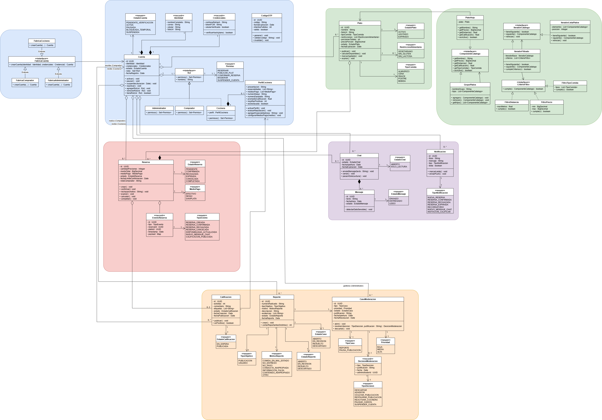
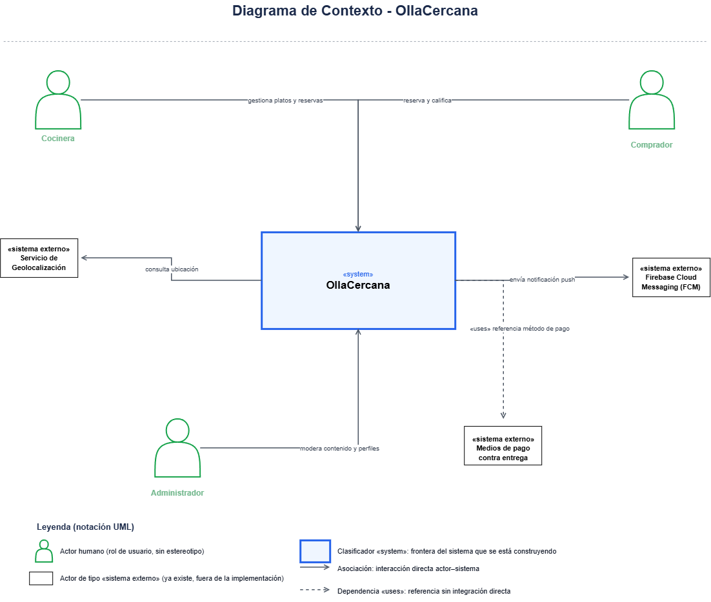
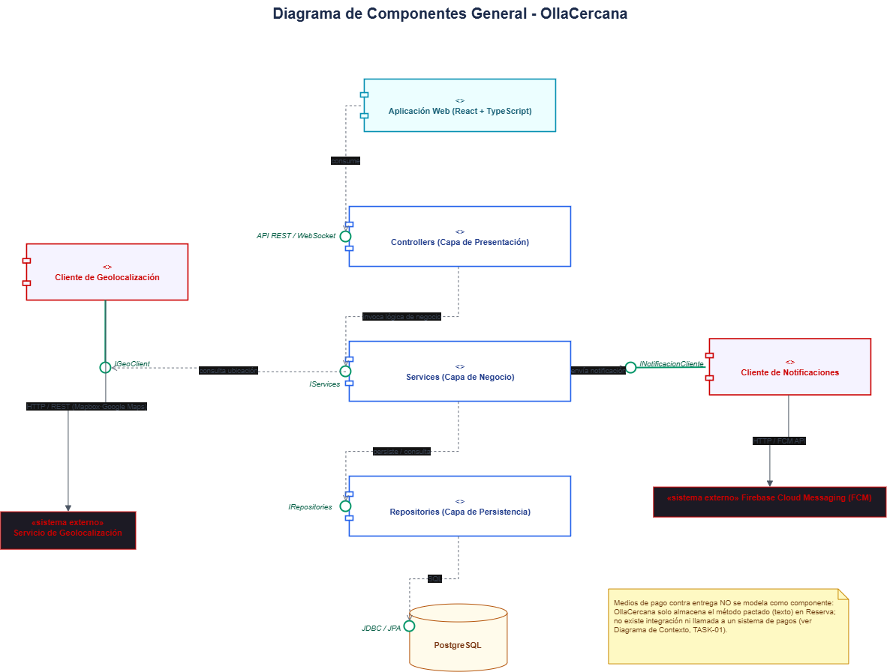
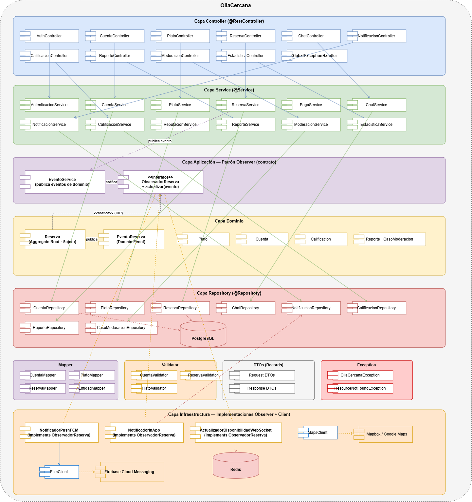
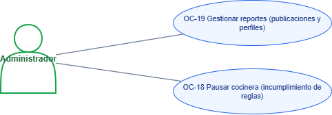
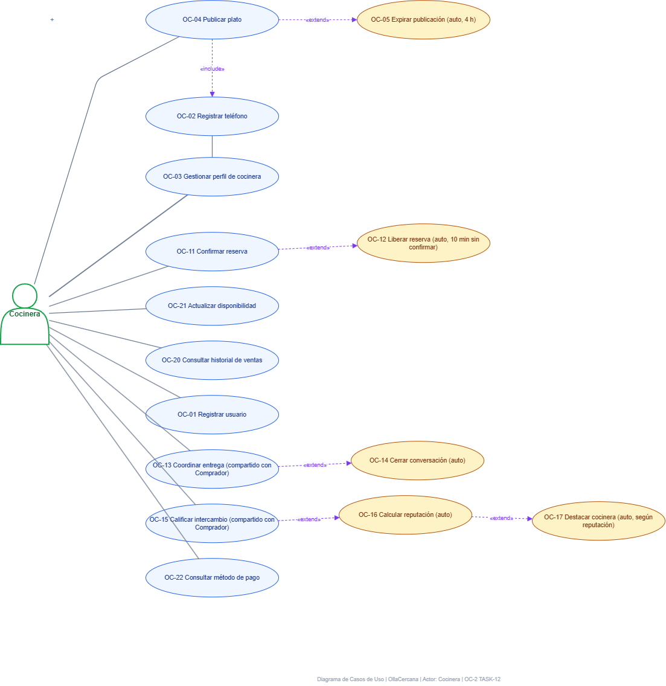
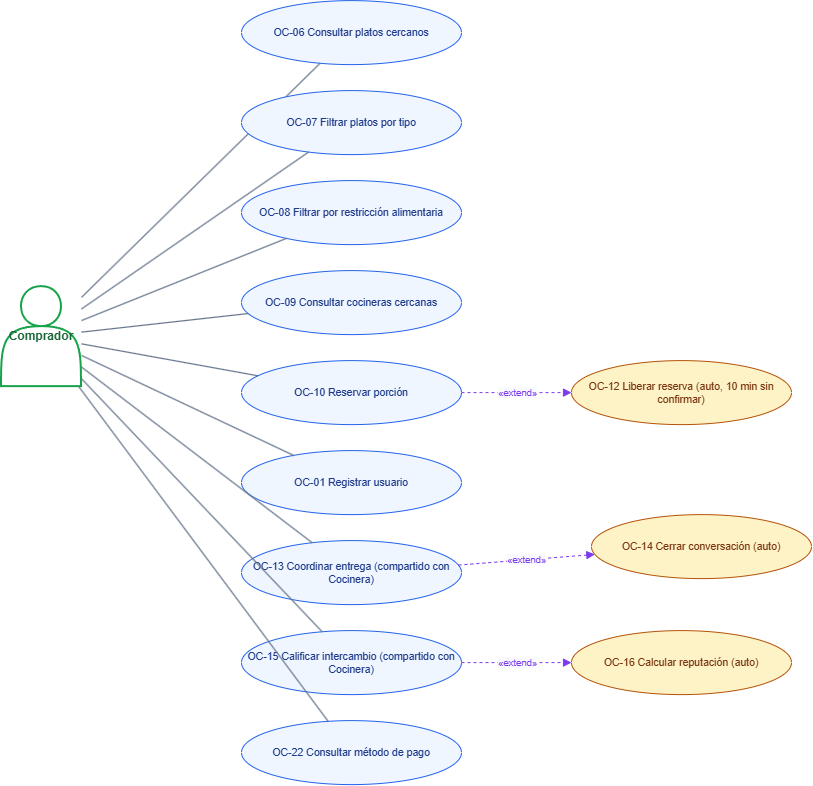

# OllaCercana

## Justificacion patrones

- Observer: Se aplica para desacoplar la publicación de eventos de dominio (cambios en reservas, disponibilidad de platos, chat) de las acciones que reaccionan a ellos (enviar push por FCM, guardar notificación in-app, difundir por WebSocket). El dominio publica el evento sin saber quién lo consume; la capa de aplicación define el contrato ObservadorReserva; la infraestructura implementa los notificadores concretos. Esto permite agregar nuevos canales de notificación sin modificar el dominio (OCP) y mantener bajo acoplamiento entre módulos (OC-015, OC-016).

- Factory Method: Se aplica para centralizar la creación de cuentas según su rol (FabricaComprador, FabricaCocinera, FabricaAdministrador). Encapsula las reglas de creación (validar unicidad de correo y celular, hashear contraseña, asignar rol inicial) en un único punto. Evita que los servicios construyan cuentas con new disperso y garantiza que toda cuenta creada cumpla las invariantes del dominio (OC-001).

- Chain of Responsibility: Se aplica para modelar el flujo de moderación de reportes y pausas por reputación. Cada eslabón (ValidadorReporte, EvaluadorReputacion, OcultamientoPreventivo, RevisorAdministrador) decide si puede manejar el caso o lo pasa al siguiente. Esto permite agregar reglas de moderación sin tocar las existentes, y separa la responsabilidad de cada paso: validar formato, evaluar reputación (RN-09), ocultar preventivamente (RN-22) y tomar la decisión final con justificación (RN-23) (OC-017, OC-018).

- Iterator / Composite: Se aplican conjuntamente para el catálogo de platos. Composite permite tratar un plato individual (PlatoHoja) o un grupo de platos (GrupoPlatos, agrupados por conjunto o cocinera) de forma uniforme, facilitando la organización jerárquica del catálogo. Iterator permite recorrer esa estructura aplicando filtros (tipo de comida, restricciones, precio, distancia) sin exponer la representación interna de la colección. Juntos resuelven la búsqueda y filtrado de platos de forma extensible y desacoplada (OC-006, OC-007, OC-008).

### Diagrama de clases

### Diagrama C4

### Diagrama de Componentes Generales

### Diagrama de Componentes Especificos

### Diagrama Casos de uso Administrador

### Diagrama Casos de uso Cocinero

### Diagrama Casos de uso Comprador

### Matriz de Roles y Permisos 

La API implementa autenticación stateless mediante JWT y control de acceso basado en roles (`@PreAuthorize`). La identidad
(`cuentaId`, `cocineraId` y `roles`) se extrae de forma segura a partir de los claims del token Bearer.

| Endpoint | Método | Roles Permitidos | Descripción / Regla |
| :--- | :---: | :--- | :--- |
| `/api/v1/sesiones` | `POST` | *Público* | Inicio de sesión, retorna JWT y lista de roles |
| `/api/v1/cuentas` | `POST` | *Público* | Registro de nueva cuenta |
| `/api/v1/platos/cercanos` | `GET` | *Público* | Catálogo de platos geolocalizados (RN-05) |
| `/api/v1/platos/{id}` | `GET` | *Público* | Detalle público de un plato |
| `/api/v1/perfiles/destacadas` | `GET` | *Público* | Listado de cocineras destacadas |
| `/api/v1/platos` | `POST` | `COCINERA` | Publicar nuevo plato del día (HU-04) |
| `/api/v1/platos/{id}/disponibilidad` | `PATCH` | `COCINERA` | Ajustar porciones (solo sobre sus propios platos) |
| `/api/v1/platos/{id}` | `DELETE` | `COCINERA`, `ADMIN` | Eliminar plato (solo su creadora o admin) |
| `/api/v1/reservas` | `POST` | `COMPRADOR` | Crear reserva de porciones (HU-04, RN-14, RN-15) |
| `/api/v1/reservas/{id}/decision` | `PATCH` | `COCINERA` | Confirmar o rechazar reserva (HU-12) |
| `/api/v1/reservas/pendientes` | `GET` | `COCINERA` | Listar solicitudes pendientes de su cocina |
| `/api/v1/reservas/{id}/completar` | `POST` | `COMPRADOR`, `COCINERA` | Cerrar transacción con entrega y pago (HU-23) |
| `/api/v1/reservas/{id}` | `GET` | `Autenticado` | Consultar reserva (solo partes involucradas o admin) |
| `/api/v1/perfiles/**` | `POST`/`PUT` | `COCINERA`, `ADMIN` | Gestión y verificación OTP de perfil de cocinera |